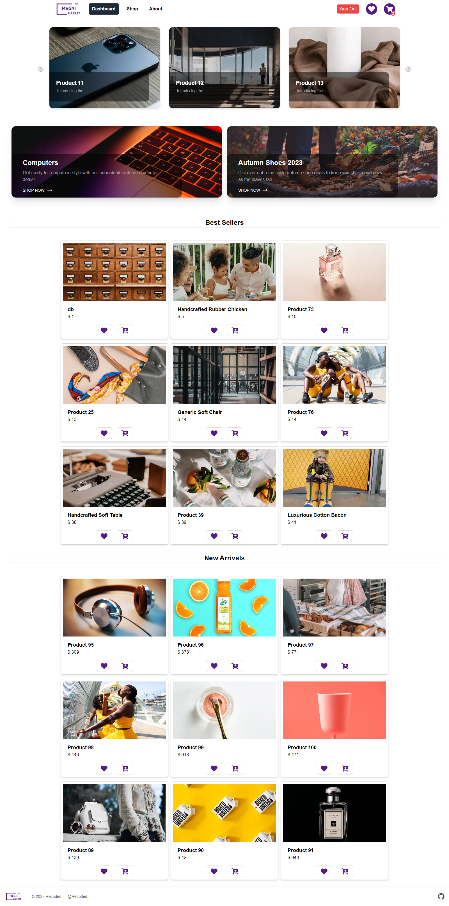

# MagniMarket E-Commerce App

## Description

The MagniMarket E-Commerce Web App is a lightweight and user-friendly online shopping platform designed to provide a simple and intuitive e-commerce experience. Users can browse a curated selection of products, filter products by name, price, or category, create an account, and add items to their shopping cart or wish list. This project serves as an ideal starting point for small-scale online businesses and a valuable learning resource for web development enthusiasts.

## Key Features

- **Product Catalog:** Browse and search for products by category or keyword.
- **Shopping Cart:** Add, remove, and view selected products in the cart.
- **Wish List:** Add, remove, and view selected products in the wish list.
- **Filter Products:** Easily filter products by name, category, and price.
- **User Authentication:** Create accounts, log in, and log out.
- **Product Details:** View detailed descriptions of products.
- **Responsive Design:** Ensure accessibility on various devices.

## Technology Stack

- **Frontend:** Next.js
- **Database:** Firestore
- **Authentication:** Firestore
- **Styling:** CSS, Tailwind CSS

## Project Goals

- Practice front-end development skills.
- Provide a simple and intuitive online shopping experience for users.
- Showcase fundamental e-commerce functionalities.
- Serve as a learning and development tool for web developers.

## Team Members

- Oussama Barka
- Mohamed Matassi
- Mouloud Mecheter
- Mohamed Cheraitia
- Milissa Sidisaid

## Getting Started

To run this project locally, follow these steps:

1. Clone the repository: `git clone https://github.com/202306-NEA-DZ-FEW/e-commerce-project-magnimarket.git`
2. Navigate to the project directory: `cd magnimarket`
3. Install dependencies: `npm install`
4. Start the development server: `npm run dev`
5. Open your browser and visit `http://localhost:3000`

## Enhancements and Future Features

- Implement secure payment processing.
- Add user reviews and ratings for products.
- Integrate social media sharing and login options.
- Enhance the product recommendation system.
- Implement an order tracking system for users.
- Expand the product catalog with more categories.

## License

This project is licensed under the [MIT License](LICENSE).
